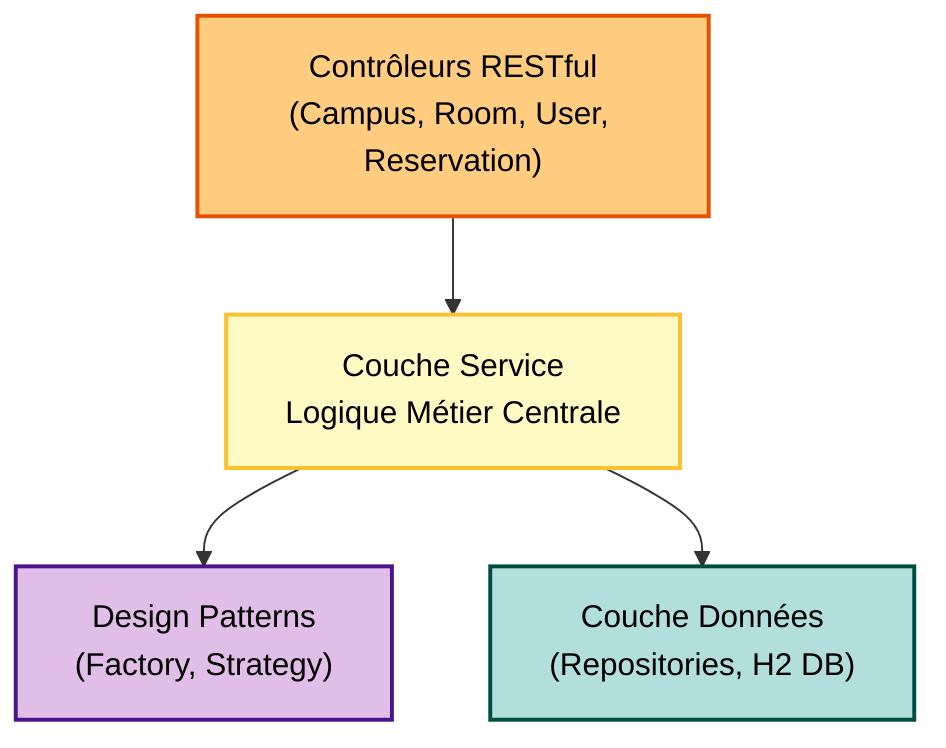

# CampusRoom API


Bienvenue sur l'API CampusRoom. Ce projet backend est construit avec Spring Boot et intègre des bases de données en mémoire (H2) pour la gestion des campus, des salles, des utilisateurs et des réservations de manière centralisée. Il suit une architecture structurée avec l'implémentation robuste de design patterns.

## 🚀 Installation & Démarrage

### Prérequis

*   Git
*   Java 21
*   Maven

### 1. Cloner le dépôt

Via HTTPS :
```bash
git clone https://github.com/IrALm/CampusRoomAPI.git
```

### 2. Lancer l'environnement

Assurez-vous d'avoir Java 21 et Maven installés, puis lancez l'application avec la commande suivante :

```bash
mvn spring-boot:run
```
| Service              | URL / Commande                                                   | Identifiants / Info                                                                                     |
| :------------------- | :--------------------------------------------------------------- | :------------------------------------------------------------------------------------------------------ |
| **API Backend**      | `http://localhost:8095/`                                         | Point d'entrée de l'API                                                                                 |
| **Swagger UI**       | [Accéder à Swagger](http://localhost:8095/swagger-ui/index.html) | Documentation interactive de l'API                                                                      |
| **H2 Database**      | `http://localhost:8095/h2-console`                               | **JDBC URL:** `jdbc:h2:mem:campusdb`<br>**User:** `sa`<br>**Password:** (vide)                          |

## 🧪 Tests

Le projet intègre des tests unitaires et une vérification de la couverture de code via **JaCoCo**.

```bash
# Lancer les tests manuellement
mvn clean test
```
```bash
# Lancer Jacoco pour voir la couverture des tests
mvn jacoco:report
```

## 🏗️ Architecture Backend

L'architecture backend s'appuie sur une **architecture multicouche (Controller-Service-Repository)**, permettant une meilleure maintenabilité et évolutivité du code. Les concepts de création et de validation de réservation sont isolés via les Design Patterns **Factory** et **Strategy**.



Une documentation technique très détaillée sur l'architecture et les Design Patterns implémentés se trouve sur ce site https://iralm.github.io/CampusRoomAPI/
